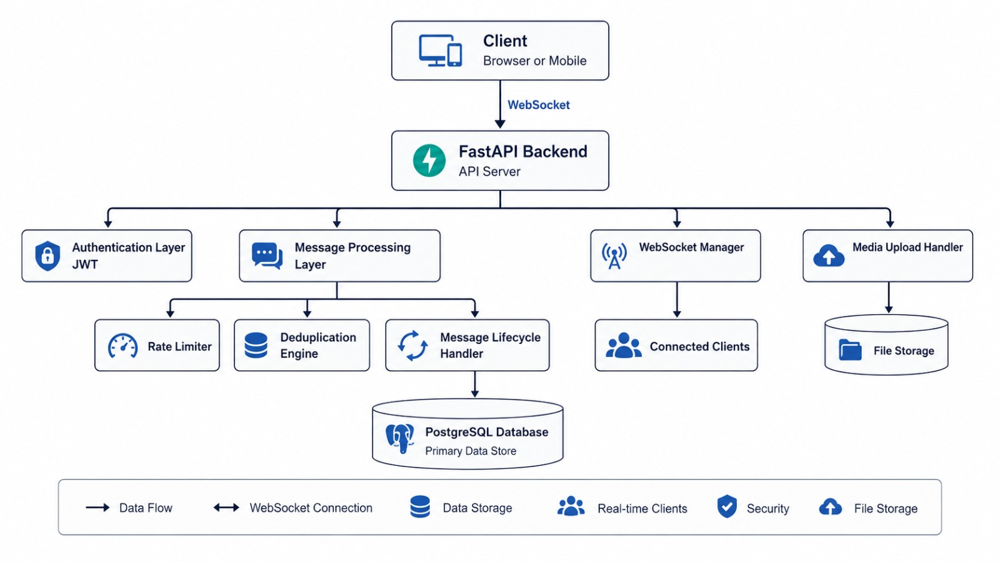

<div align="center">

# ⚡ ZapTalk

### A Scalable Real-Time Messaging System with WebSocket-Based Delivery

[](https://fastapi.tiangolo.com)
[](https://www.postgresql.org)
[](https://developer.mozilla.org/en-US/docs/Web/API/WebSockets_API)
[](https://www.python.org)
[](https://www.sqlalchemy.org)
[](https://www.docker.com)
[](https://zaptalk-kt8y.onrender.com)
[](#license)

*Built for backend engineering depth — real-time communication, message reliability, and scalable architecture*

### 🌐 [Live Demo → https://zaptalk-kt8y.onrender.com](https://zaptalk-kt8y.onrender.com)

> ⚠️ Free tier — first load may take 30-50 seconds to wake up

</div>

---

## 📌 Overview

ZapTalk is a high-performance real-time chat system engineered to handle low-latency communication, message lifecycle consistency, and scalable group messaging.

The project focuses on **backend engineering concepts** — real-time communication, reliability, and system scalability — rather than just UI features.

---

## 🚀 Highlights

| What | Why It Matters |
|---|---|
| ⚡ WebSocket-based messaging | Eliminates polling overhead, enables true real-time bidirectional communication |
| 🔄 4-stage message lifecycle | Tracks every message from sent → delivered → read with full consistency |
| 🧠 Deduplication engine | `client_message_id` ensures idempotent delivery across retries and reconnects |
| 🛡️ Rate limiting | Per-user 20 msg/min cap prevents spam and protects WebSocket infrastructure |
| 👥 Group fan-out | Efficient broadcast architecture for multi-user delivery |
| 🔐 JWT + bcrypt security | Industry-standard auth on every REST and WebSocket endpoint |
| 🐳 Dockerized deployment | Full containerization with Docker Compose for one-command setup |
| ☁️ Cloud deployed | Live on Render with PostgreSQL — accessible from anywhere |
| 📶 Offline message queue | localStorage queue with auto-flush on reconnect |

---

## ❗ Problem Statement

Real-time communication systems face multiple challenges:

- High latency in polling-based architectures
- Message duplication due to retries or unstable networks
- Difficulty tracking message lifecycle (sent → delivered → read)
- Inefficient delivery in group messaging scenarios
- Scalability issues with increasing concurrent users
- Message loss during temporary network disconnections

---

## ✅ Proposed Solution

ZapTalk addresses these challenges through:

- WebSocket-based real-time communication
- Message lifecycle tracking system
- Deduplication via client-generated identifiers
- Rate limiting to prevent abuse
- Efficient group message fan-out architecture
- Docker-based containerization for consistent deployment
- Offline queue via localStorage with auto-flush on reconnect

---

## ✨ Features

<details>
<summary><strong>⚡ Real-Time Messaging</strong></summary>

- Instant message delivery using WebSockets
- Typing indicators and live presence updates
- Real-time communication between multiple users

</details>

<details>
<summary><strong>📬 Message Lifecycle</strong></summary>

- Sent → Delivered → Read tracking
- Synchronization across multiple clients
- Lifecycle consistency across devices

</details>

<details>
<summary><strong>✏️ Message Management</strong></summary>

- Edit messages with timestamps and `(edited)` tag
- Soft delete functionality
- Emoji reactions support

</details>

<details>
<summary><strong>🖼️ Media Support</strong></summary>

- Image upload (JPEG, PNG, GIF, WebP)
- Image preview and storage handling
- Media message delivery and deletion

</details>

<details>
<summary><strong>👥 Group Chat</strong></summary>

- Create and manage groups
- Broadcast messages to multiple users
- Efficient group fan-out delivery

</details>

<details>
<summary><strong>📶 Offline Support</strong></summary>

- Messages queued in localStorage when offline
- Auto-flush on WebSocket reconnect
- Deduplication prevents duplicate sends on retry

</details>

<details>
<summary><strong>🐳 Docker Support</strong></summary>

- Fully containerized with Docker and Docker Compose
- Isolated service environments (app + database)
- Automated database migrations on container startup
- One-command setup for local development and deployment

</details>

---

## 🏗️ Architecture



### Architecture Highlights

| Component | Role |
|---|---|
| **Client** | Browser — sends/receives via WebSocket, queues offline messages |
| **FastAPI Backend** | API routing, auth, message processing, WS handling |
| **Authentication Layer** | JWT validation on every request and WebSocket connection |
| **Message Processing Layer** | Rate limiting, deduplication, lifecycle tracking |
| **WebSocket Manager** | Connection pool, online tracking, event broadcast |
| **Media Upload Handler** | File validation, storage, delivery |
| **PostgreSQL Database** | Persistent storage for all messages, users, groups |
| **Docker Compose** | Orchestrates app + database containers with health checks |

---

## 🔄 Data Flow

```
1.  User connects to FastAPI backend via WebSocket
2.  JWT authentication validates the sender
3.  Rate limiter checks request frequency (max 20/min)
4.  Deduplication engine checks client_message_id
5.  Message is stored in PostgreSQL
6.  ACK is sent back to the sender
7.  WebSocket Manager broadcasts to recipient(s)
8.  Message status updated: sent → delivered → read
9.  All connected clients receive updates in real time
10. If offline, message is queued in localStorage and auto-sent on reconnect
```

---

## 🗂️ Project Structure

```
realtime-hybrid-chat-system/
│
├── app/
│   ├── auth/               # Authentication, JWT, bcrypt
│   │   ├── routes.py
│   │   ├── jwt_handler.py
│   │   ├── hashing.py
│   │   └── schemas.py
│   ├── chat/               # Chat APIs, WebSocket, messaging logic
│   │   ├── routes.py
│   │   └── websocket.py
│   ├── core/               # Rate limiter and core utilities
│   ├── db/                 # Database session and base config
│   └── models/             # SQLAlchemy models (User, Message, Group)
│
├── alembic/                # Database migrations
│   └── versions/
├── frontend/               # Vanilla HTML/CSS/JS chat UI
│   └── index.html
├── dockerfile              # Docker image definition
├── docker-compose.yml      # Multi-container orchestration
├── .dockerignore           # Docker build exclusions
├── .env.example            # Environment variable template
├── main.py                 # FastAPI app entry point
├── requirements.txt
├── README.md
└── .gitignore
```

---

## 🛠️ Tech Stack

| Layer | Technology |
|---|---|
| **Backend Framework** | FastAPI (async Python) |
| **Database** | PostgreSQL |
| **ORM** | SQLAlchemy |
| **Migrations** | Alembic |
| **Auth** | JWT (`python-jose`) + bcrypt (`passlib`) |
| **Real-time** | Starlette WebSockets |
| **Frontend** | Vanilla HTML, CSS, JavaScript |
| **Server** | Uvicorn (ASGI) |
| **Containerization** | Docker + Docker Compose |
| **Cloud Deployment** | Render |

---

## 🔌 API Reference

### Authentication

| Method | Endpoint | Description |
|---|---|---|
| `POST` | `/auth/register` | Register a new user |
| `POST` | `/auth/login` | Authenticate and receive JWT token |
| `GET` | `/auth/me` | Get current authenticated user |
| `GET` | `/auth/users` | List all users |

### Messaging

| Method | Endpoint | Description |
|---|---|---|
| `POST` | `/chat/start/{user_id}` | Start or get a conversation |
| `GET` | `/chat/messages/{conv_id}` | Fetch chat history |
| `POST` | `/chat/upload` | Upload an image |
| `POST` | `/chat/read/{conv_id}` | Mark messages as read |

### WebSocket

| Protocol | Endpoint | Description |
|---|---|---|
| `WebSocket` | `/chat/ws/{user_id}` | Real-time bidirectional messaging |

### WebSocket Event Types

| Event | Direction | Description |
|---|---|---|
| `message` | Both | Send/receive a chat message |
| `typing` | Client → Server | Typing indicator |
| `reaction` | Client → Server | Emoji reaction on a message |
| `edit` | Client → Server | Edit a sent message |
| `delete` | Client → Server | Delete a message |
| `read` | Client → Server | Mark messages as read |
| `ack` | Server → Client | Message delivery confirmation |
| `status_update` | Server → Client | Tick status update |
| `online_status` | Server → Client | User online/offline update |

---

## 🔐 Security

- JWT-based stateless authentication
- Password hashing using bcrypt
- Protected REST and WebSocket endpoints
- Input validation and access control
- Per-user rate limiting (20 messages/minute)

---

## 🚀 Getting Started

### Prerequisites

- [Docker Desktop](https://www.docker.com/products/docker-desktop) (recommended)
- Git

### 🐳 Run with Docker (Recommended)

```bash
# 1. Clone the repo
git clone https://github.com/venunathan07/realtime-hybrid-chat-system.git
cd realtime-hybrid-chat-system

# 2. Copy environment variables
cp .env.example .env

# 3. Start all services (app + database)
docker-compose up --build
```

**Chat UI →** `http://localhost:8000`

**API Docs →** `http://localhost:8000/docs`

> Database migrations run automatically on container startup.

---

### 🔧 Manual Setup (Without Docker)

```bash
# 1. Clone
git clone https://github.com/venunathan07/realtime-hybrid-chat-system.git
cd realtime-hybrid-chat-system

# 2. Install dependencies
pip install -r requirements.txt

# 3. Configure environment
cp .env.example .env
# Edit .env with your local PostgreSQL credentials

# 4. Run migrations
alembic upgrade head

# 5. Start server
uvicorn main:app --reload
```

**Chat UI →** `http://localhost:8000`

**API Docs →** `http://localhost:8000/docs`

---

## 📈 Scalability

### Current Limitations

| Area | Limitation |
|---|---|
| WebSocket | Single-instance only |
| Media | Stored locally on server |
| Cache | No distributed layer |
| Deployment | Single-region |

### Scaling Roadmap

| Solution | Addresses |
|---|---|
| Redis Pub/Sub | Multi-server WebSocket sync |
| Load balancer | Horizontal backend scaling |
| CDN | Media delivery at scale |
| Kubernetes | Container orchestration |
| Database replication | Read throughput |

---

## ⚠️ Known Issues

| Issue | Status | Planned Fix |
|---|---|---|
| WebSocket scaling is single-instance | Open | Redis Pub/Sub |
| Media stored locally | Open | S3 / Cloudflare R2 |
| No push notifications | Open | Web Push API + VAPID |
| No distributed cache | Open | Redis integration |
| Free tier spins down after inactivity | Open | Upgrade to paid tier |

---

## 🗺️ Future Improvements

- [x] Docker Compose setup
- [x] Cloud deployment (Render)
- [x] Offline message queue (localStorage + auto-flush)
- [x] Image upload and deletion
- [x] Emoji reactions
- [x] Message edit and soft delete
- [ ] Redis-based distributed WebSocket scaling
- [ ] Push notifications (Web Push API)
- [ ] End-to-end encryption
- [ ] Image storage on S3 / Cloudflare R2
- [ ] Kubernetes orchestration
- [ ] Prometheus + Grafana monitoring

---

## 📄 License

Developed for academic and learning purposes only.
Not intended for commercial use or redistribution without permission.

---

<div align="center">

Built by **[Venunathan](https://github.com/venunathan07)**

🌐 **Live Demo:** [https://zaptalk-kt8y.onrender.com](https://zaptalk-kt8y.onrender.com)

⭐ Star this repo if it helped you learn something

</div>
